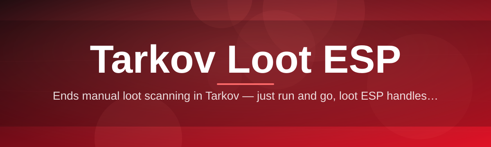
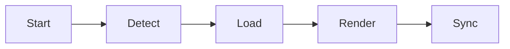

# tarkov-loot-overlay 🎯🗺️

  

*See the raid before the raid sees you — a loot overlay built for players who value their time.*

  

---

## 🧭 Overview

Raids in Tarkov are long. Loot spawns are random. Most of that time is spent walking into rooms hoping something good exists — and leaving empty-handed. **tarkov-loot-overlay** is a lightweight external overlay that renders known loot locations, container tiers, and item values directly over your game view, so every extraction decision is informed instead of guessed.

This isn't a gameplay modifier. It doesn't touch game files, doesn't inject into the process, and doesn't alter server data. It reads publicly available map/loot data and paints an informational layer on top — the same category of tool as a stream overlay or a companion app, just synced to your screen in real time. Think of it as a co-pilot for loot routing: it tells you *where* to look, you still decide *what* to do about it.

Built for solo scavs tired of dry runs, loot-run speedrunners optimizing PMC routes, and squad leads who need to call out high-value targets without alt-tabbing to a wiki. If you've ever paused mid-raid to check a browser tab for spawn locations, this tool exists to remove that friction entirely.

## 🚀 Get It

---

## ⚔️ Before vs. After

| | Without tarkov-loot-overlay | With tarkov-loot-overlay |
|---|---|---|
| **Loot routing** | Wander, hope, backtrack | Direct paths to known containers |
| **Raid pace** | Slow, exploratory | Fast, decisive |
| **Item ID** | Alt-tab to wiki mid-raid | On-screen value tags, zero context switch |
| **High-tier spawns** | Missed entirely | Highlighted and prioritized |
| **Squad coordination** | Verbal guesswork | Shared visual reference points |
| **Post-raid regret** | "I walked right past that" | Rare |

---

## 🔥 What It Actually Does

- **Live loot rendering** — overlays known container and static spawn positions on your screen, updated per-map without restarting the client.

- **Value-tiered highlighting** — color-coded by rarity and rouble value, so a glance tells you if it's worth the detour.

- **Container-aware filtering** — toggle visibility per container type (safes, jackets, weapon boxes, ground spawns) to cut visual noise.

- **Map-synced overlay** — automatically detects the active map and swaps the loot layer accordingly, no manual selection needed.

- **Zero-footprint rendering** — draws externally, above the game window, without touching game memory or process space.

- **Custom threshold filters** — set a minimum item value so only genuinely worthwhile loot appears.

- **Distance-based fading** — items outside a configurable radius dim out, keeping the near-field view clean.

- **Session persistence** — your filters, theme, and hotkey layout survive between launches.

> [!TIP]
> Run the overlay in **windowed borderless** mode for best alignment. Fullscreen exclusive can cause the overlay to render behind the game on some GPU drivers.

---

## 🏁 Up and Running

1. Open the landing page via the **GET** button above.

2. Download the latest standalone build — no installer wizard, no bundled extras.

3. Extract the folder anywhere (Desktop, Downloads, wherever) — it runs from its own directory.

4. Launch `tarkov-loot-overlay.exe`, start your raid, and the layer appears automatically once the map loads.

> [!NOTE]
> First launch may take a few extra seconds while the overlay caches map data locally. Subsequent launches are near-instant.

---

## 💻 System Requirements

| Component | Minimum |
|---|---|
| OS | Windows 10 (64-bit) or Windows 11 |
| Dependencies | None — fully standalone executable |
| GPU | Any DirectX 11-capable card |
| RAM | 4 GB free |
| Display | Windowed borderless or Fullscreen Windowed |

  

> [!IMPORTANT]
> This tool does not require .NET, Visual C++ redistributables, or any third-party runtime to be pre-installed. Everything ships in the executable.

---

## ⚙️ How It Works

The overlay operates as a separate rendering process that sits visually above the game — it never reads or writes game memory.

1. **Detect** — identifies the active map from window/session context.

2. **Load** — pulls the corresponding loot dataset for that map.

3. **Render** — draws positional markers on a transparent top-level window.

4. **Sync** — refreshes marker positions and filters as you move and adjust settings.

5. **Persist** — saves your last-used filters and theme for next raid.

---

## 🧩 Troubleshooting

<strong>The overlay doesn't appear over the game.</strong>

Switch the game to windowed borderless mode. Fullscreen exclusive mode bypasses the Windows compositor, which the overlay relies on for layering.

<strong>Loot markers are misaligned with the actual room.</strong>

Check your in-game resolution matches your monitor's native resolution. Scaled resolutions shift the overlay's coordinate mapping.

<strong>The app won't launch, no error shown.</strong>

Right-click the executable → Properties → Unblock, if the file was flagged after download. Some browsers mark downloaded executables by default.

<strong>Frame rate drops when the overlay is active.</strong>

Lower the render distance filter in Settings → Display. Rendering hundreds of markers simultaneously on low-end GPUs can cost a few frames.

<strong>Markers stopped updating mid-raid.</strong>

This usually means a map transition (extract/load screen) wasn't detected. Toggle the overlay off and on with the hotkey to force a re-sync.

> [!WARNING]
> Antivirus heuristics occasionally flag overlay tools that render above other windows. This is a false positive common to this category of software — add an exclusion if your AV quarantines the executable.

---

## 🎨 UI / UX Details

| Action | Hotkey |
|---|---|
| Toggle overlay visibility | `F1` |
| Cycle value-filter tiers | `F2` |
| Open settings panel | `F3` |
| Reset overlay position | `F4` |

- **Themes** — Dark (default), High-Contrast, and Minimal (icons only, no labels).

- **Opacity slider** — adjust overlay transparency from 10% to 100%.

- **Marker size scaling** — independent of game resolution scaling.

- **Per-map presets** — save different filter setups for Customs, Woods, Streets, etc.

> [!TIP]
> The Minimal theme is best for low-end systems and screen recording — fewer draw calls, cleaner footage.

---

## 🤝 Contributing & Community

Contributions are welcome — map data corrections, UI polish, translation help, and bug reports all matter equally.

> Found a loot position that's outdated after a wipe? Open an issue with the map name and coordinates — data accuracy is a community effort.

- Open an **Issue** for bugs or incorrect spawn data.

- Open a **Discussion** for feature requests or theme suggestions.

- Submit a **Pull Request** for code contributions — keep changes scoped and documented.

---

## 📜 License

Released under the [MIT License](LICENSE), 2026. Use it, fork it, build on it — just keep the license notice intact.

---

## ⚠️ Disclaimer

This project provides an **informational overlay** rendered externally — it does not modify game files, read protected memory, or interact with game servers. It is provided as-is, without warranty. Use of any third-party tool alongside an online game carries inherent risk per that game's terms of service; the maintainers of this project are not responsible for account actions taken as a result of use. Always review the current rules of the game you're playing.

---

